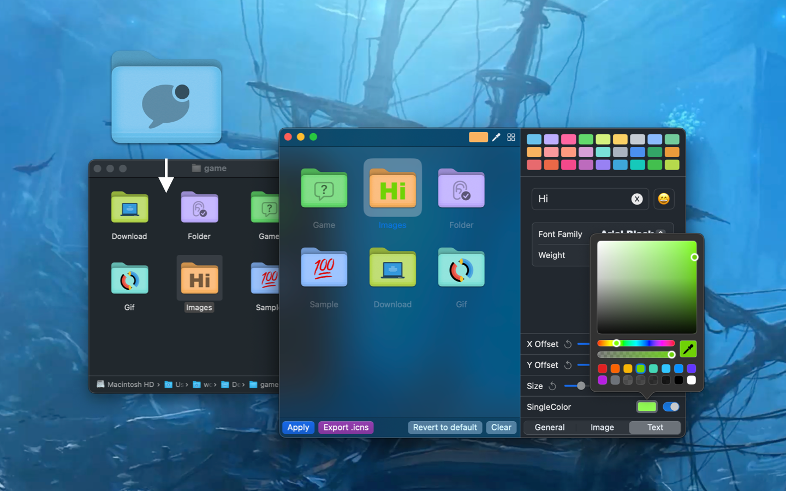

<div align="center">
  <br />
  <br />
  
  <h1>
    Iconize Folder
  </h1>
  <!--rehype:style=border: 0;-->
  <p>
    <a href="./README.zh.md">简体中文</a> • 
    <a target="_blank" href="https://github.com/jaywcjlove/IconizeFolder/issues/new?template=bug_report.yml">Contact & Support</a> • 
    <a href="./CHANGELOG.md">Changelog</a>
  </p>
  <p>
    <a target="_blank" href="https://apps.apple.com/app/iconize-folder/id6478772538" title="Iconize Folder for macOS">
      
    </a>
  </p>
</div>





With this tool, you can easily customize folder colors and icons, making file management more intuitive and efficient. Choose from over 5,000 symbol icons, create your own color schemes, add image icons or Emojis, and even insert text in various fonts.
Design personalized folders that stand out visually and enhance overall clarity.

### Features

- 5000+ built-in symbol icons
- Adjustable icon opacity and size
- Customizable folder icon colors
- Supports text, emojis, and images in icons
- Quickly import folder paths to Dock
- Export folder icons as .icns files

New features include the ability to adjust the transparency and size of symbol icons, a wider selection of folder colors, and quick import of folder paths to the Dock. You can also export your custom folder icons as .icns files for use elsewhere.

### URL Schemes

Use this URL Scheme to quickly open a folder at a specified path. For example, `iconizefolder:///Users/wangchujiang/Desktop/test/` will open the `test` folder on the desktop.

```url
iconizefolder://<Folder Path>
iconizefolder:///Users/wangchujiang/Desktop/test/
```