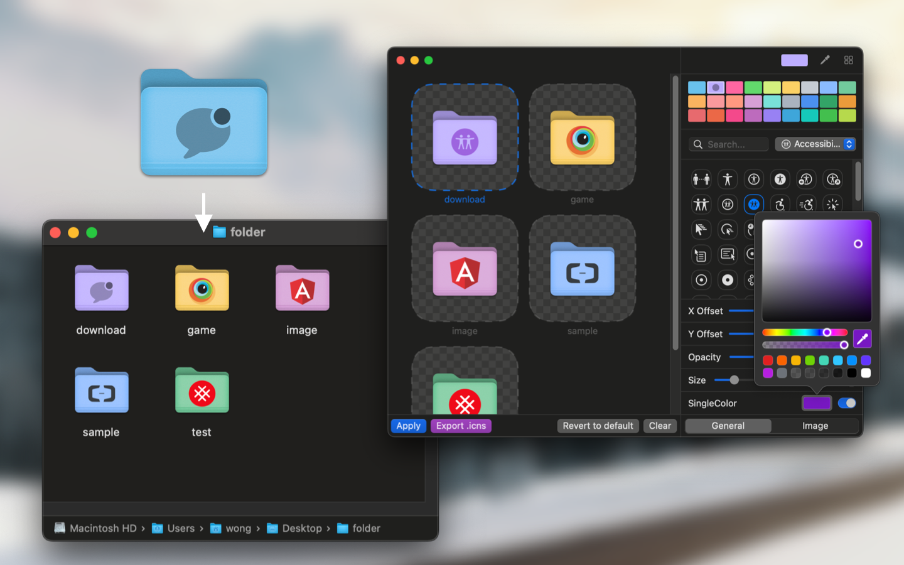
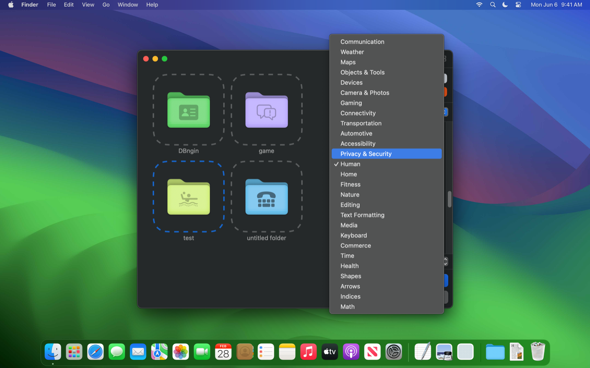
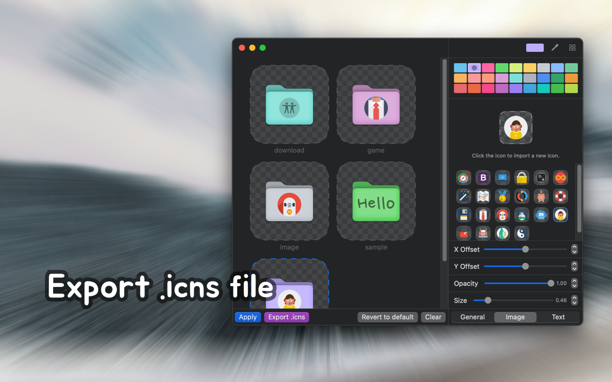

   
   
  
  <h1>
    Iconize Folder
    v1.1.0
    <!--rehype:style=font-size: 12px;top: 0;line-height: inherit;vertical-align: text-top;font-weight: 200;color: var(--color-fg-subtle);-->
  </h1>
  <!--rehype:style=border: 0;-->
  

    <a href="./README.md">English</a> • 
    <a href="https://github.com/jaywcjlove/IconizeFolder/issues/new?assignees=jaywcjlove&labels=support%2Cfeedback%2Cquestion&projects=&template=bug_report_cn.yml&title=%F0%9F%99%8B%E2%80%8D%E2%99%82%EF%B8%8F+%E6%94%AF%E6%8C%81%E4%B8%8E%E5%8F%8D%E9%A6%88%3A+IconizeFolder">联系&支持</a> • 
    <a href="https://github.com/jaywcjlove/IconizeFolder/releases">变更日志</a>
  

  

    
  

使用这个工具，可以轻松设置文件夹颜色并添加小图标，帮助你更高效地管理文件。

选择来自超过 5000 种多样符号图标的独特性，选择十多种预设的鲜艳颜色，或自定义你的色彩方案，以满足个人偏好。让你的文件夹和文档充满个性化标识，改变单调的文件管理，让视觉效果更加丰富多彩。

## 功能特点

- 超过 5000 种多样符号图标设置
- 支持符号图标透明度大小设置
- 支持设置文件夹图标颜色
- 支持快速将需要设置的文件夹路径导入到 Dock
- 支持将文件夹图标导出为 icns 格式

用个性化和独家标识提升您的文件夹和文档。将文件管理从单调转变为视觉盛宴！
