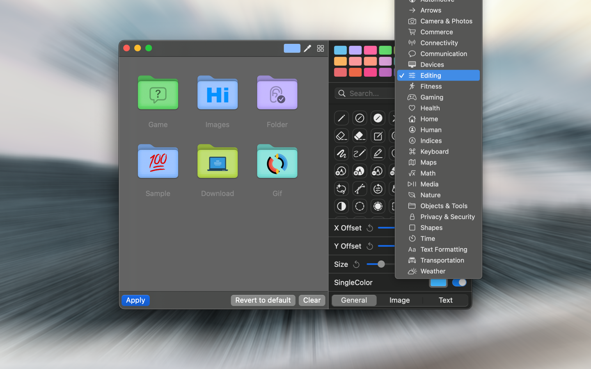
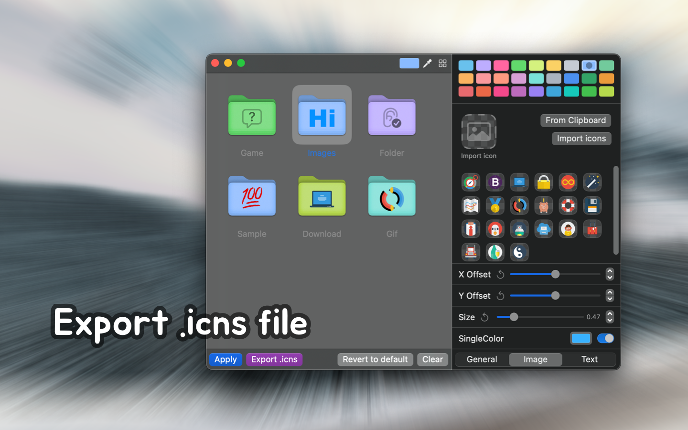

<div align="center">
  <br />
  <br />
  
  <h1>
    Iconize Folder
  </h1>
  <!--rehype:style=border: 0;-->
  <p>
    <a href="./README.md">English</a> • 
    <a target="_blank" href="https://github.com/jaywcjlove/IconizeFolder/issues/new?template=bug_report_cn.yml">联系&支持</a> • 
    <a href="./CHANGELOG.zh.md">更新日志</a>
  </p>
  <p>
    <a target="_blank" href="https://apps.apple.com/app/iconize-folder/id6478772538" title="Iconize Folder for macOS">
      
    </a>
  </p>
</div>






使用本工具，你可以轻松为文件夹设置颜色和图标，使文件管理更加直观高效。你可以从 5000+ 符号图标中选择，也可以自定义颜色方案、添加图片图标或 Emoji，还支持添加文字。
打造专属的个性化文件夹，提升视觉层次感与辨识度。

### 功能特点

- 内置 5000+ 符号图标
- 支持图标透明度与大小调整
- 可自定义文件夹图标颜色
- 图标支持文字、Emoji 与图片
- 一键导入文件夹路径至 Dock
- 支持导出为 .icns 图标文件

新增的功能包括符号图标的透明度与大小调整、丰富的文件夹颜色选择、以及快速导入文件夹路径到 Dock。你还可以将自定义的文件夹图标导出为 .icns 格式，方便在其他地方使用。

### URL Schemes

使用此 URL Scheme 可以快速打开指定路径的文件夹。例如，`iconizefolder:///Users/wangchujiang/Desktop/test/` 将打开桌面上的 `test` 文件夹。

```url
iconizefolder://<文件夹路径>
iconizefolder:///Users/wangchujiang/Desktop/test/
```